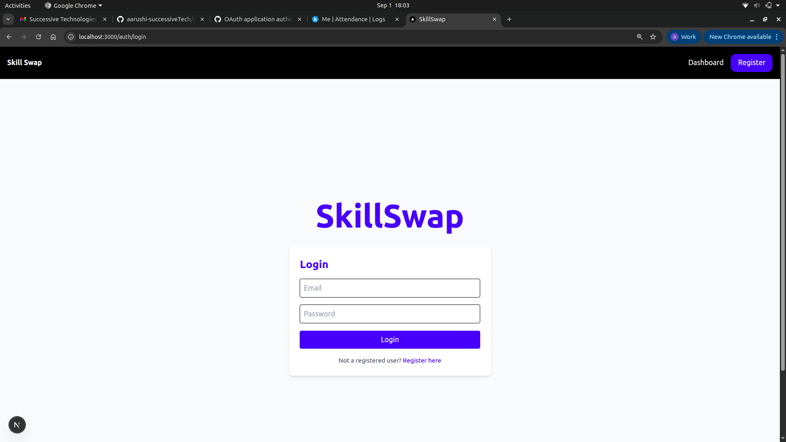
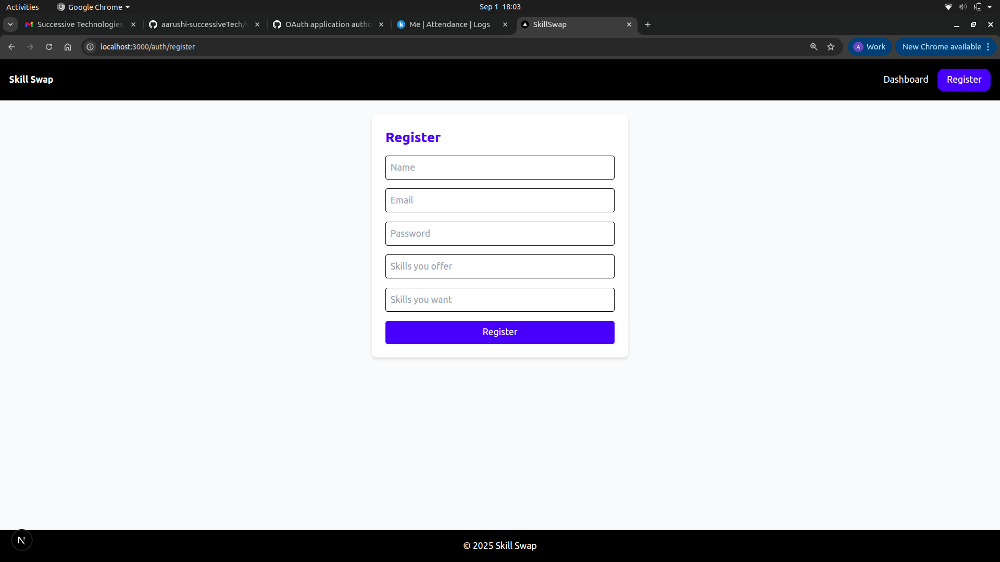
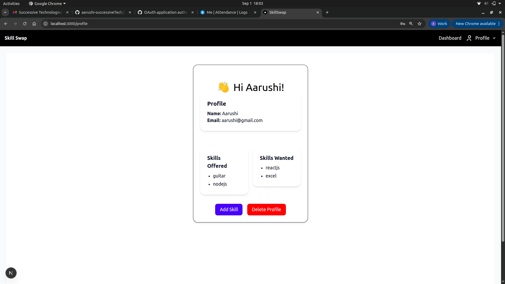
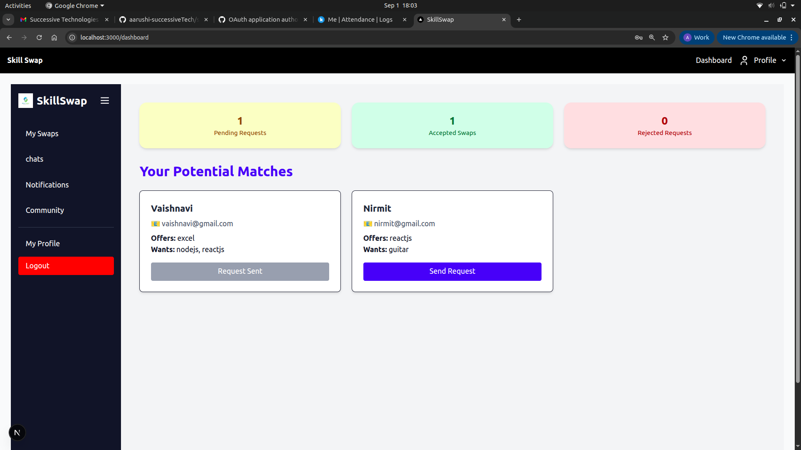
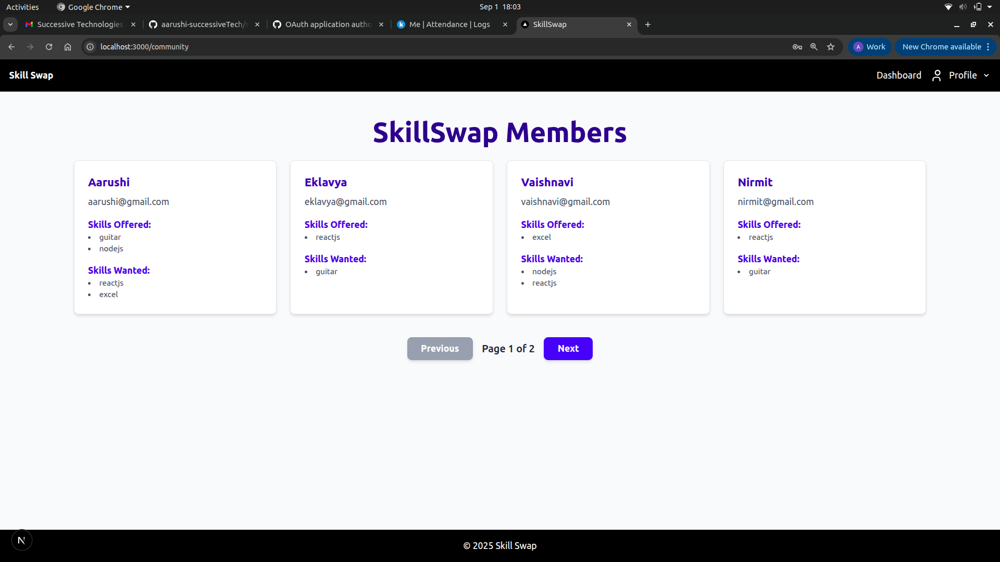
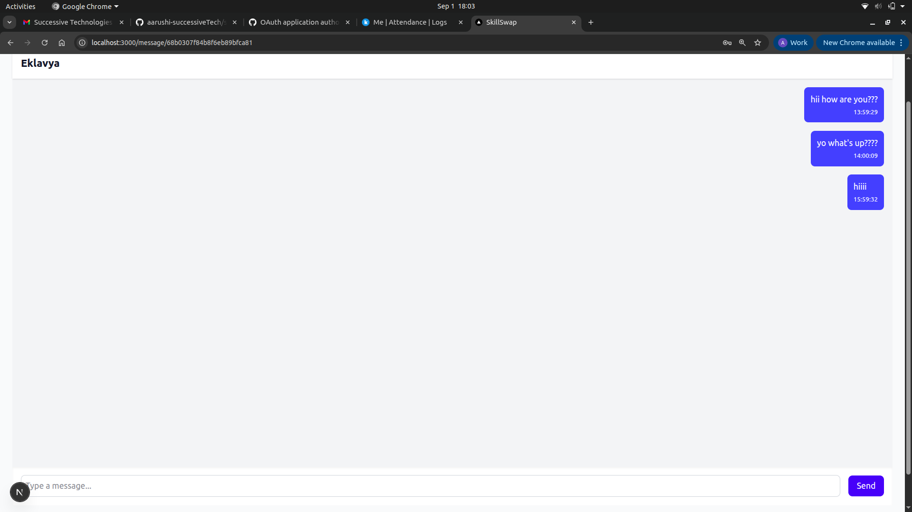
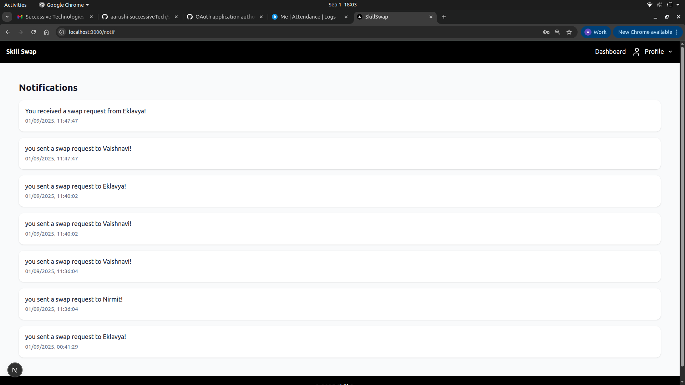
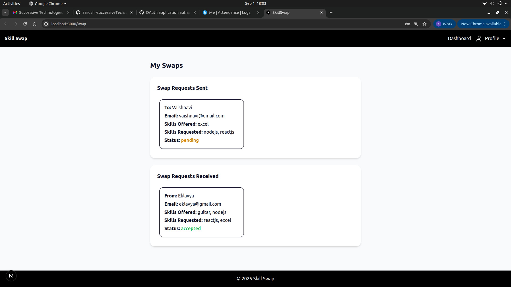

# Skill Swap App 👋
Teach what you know, learn what you need.

## Key Features Implemented ✨
1. User Authentication: Secure user registration and login functionality. Users can create a new account or log in with existing credentials to access the app's features.

2. Profile and Skills Management: Users can add, update, and manage their skills. This includes skills they are willing to teach (Skills Offered) and skills they want to learn (Skills Wanted).

3. Swap Section: This feature allows users to see their connections and potential swap partners based on their skills.

4. Real-Time Chat: A dedicated chat section for users to communicate with their connections in real time to discuss potential skill swaps.

5. Dashboard: The central hub where users can discover and explore potential users and their skills, making it easy to find a suitable match.

6. Notifications: A notifications tab to keep users updated on new messages, swap requests, or other important activities within the app.

## Tech Stack 💻
- Frontend: Built with Next.js for a fast and dynamic user experience.

- Backend: Powered by Node.js for the server-side logic.

- GraphQL: Apollo Server is used to handle all GraphQL queries and mutations, providing an efficient way to fetch and send data.

- Database: MongoDB is used as the NoSQL database to store user and skill information.

- Real-time Functionality: GraphQL Subscriptions and PubSub are implemented to enable real-time updates for features like notifications.

## How To Run ▶️
1. start the Backend
- cd backend
- node src/app.js
- This will start backend available at port: http://localhost:5000

2. start the Graphql
- cd backend_server
- npm run dev 
- This will start the graphql server at: http://localhost:4000/graphql

3. start the Frontend 
- cd frontend
- npm run dev 
- This will start the frontend at: http://localhost:3000

## Project Demo 🚀

1. User Registration and Login
- 
- 
2. Profile and Skills
- 
3. Dashboard
- 
4. Community Dashboard
- 
5. Chat Interface
- 
6. Notifications
- 
7. Swaps
- 